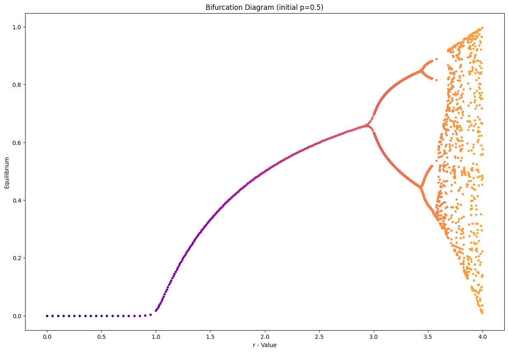

# An Exploration of the Mandelbrot-Set, Julia-Set and the chaotic Bifurcation


```python
import numpy as np
import matplotlib.pyplot as plt
from matplotlib import colormaps
```

## Naive Implementation


```python
def create_mandelbrot(c):
    f = lambda x: x**2 + c
    return f

def stability(number, it):
    return number / it

def run(f, it):
    x = 0
    
    number = 0
    for i in range(it):
        number = i
        x = f(x)
        if abs(x) > 2:
            break
    
    return stability(number, it)

```


```python
def plot_mandelbrot(r_upper=.5, r_lower=-2, i_upper=1.5, i_lower=-1.5, it=20):
    x = np.arange(r_lower, r_upper, 0.005)
    y = np.arange(i_lower, i_upper, 0.005)

    xv, yv = np.meshgrid(x, y)

    complex = xv + yv * 1j

    res = np.zeros(complex.shape)

    for idx, c in np.ndenumerate(complex):
        res[idx] = run(create_mandelbrot(c), it)

    plt.figure(figsize=(15,10))
    plt.imshow(res, extent=[r_lower, r_upper, i_lower, i_upper])
    plt.title("Mandelbrot")
    plt.xlabel("RE(c)")
    plt.ylabel("Im(c)")
    

plot_mandelbrot()


```


    

    


## Matrix-wise Implementation


```python
R_UPPER = .5
R_LOWER = -2
I_UPPER = 1.3
I_LOWER = -1.3
```


```python
def mandelbrot(x, c):
    return x**2 + c

def create_grid(stepsize, r_upper=R_UPPER, r_lower=R_LOWER, i_upper=I_UPPER, i_lower=I_LOWER):
    x = np.arange(r_lower, r_upper, stepsize)
    y = np.arange(i_lower, i_upper, stepsize)

    xv, yv = np.meshgrid(x, y)

    return xv + yv * 1j
```


```python
# it: max number of iterations to run
# sample_step: the sample step size of the grid
def plot_mandelbrot(it, sample_step, cmap="viridis"):
    # to handle overflow of very large numbers
    err_setting = np.seterr(over='ignore', invalid='ignore')
    grid = create_grid(sample_step)

    x = 0
    res = []
    for i in range(it):
        x = mandelbrot(x, grid)

        res.append((np.abs(x) <= 2).astype(int))

    stabil = np.stack(res, axis=0).sum(axis=0)

    plt.figure(figsize=(15,10))
    plt.imshow(stabil, extent=[R_LOWER, R_UPPER, I_LOWER, I_UPPER], cmap=cmap)
    plt.title("Mandelbrot")
    plt.xlabel("RE(c)")
    plt.ylabel("Im(c)")
    
```


```python
plot_mandelbrot(20, 0.0005)
```


    

    


You can alter the colormap! An Overview of availible maps can you find [here](https://matplotlib.org/stable/users/explain/colors/colormaps.html)


```python
list(colormaps)[5]
```


    'twilight'


```python
plot_mandelbrot(20, 0.005, "afmhot")
```


    

    


## Julia Set


```python
R_UPPER = 1.5
R_LOWER = -1.5
I_UPPER = 1.5
I_LOWER = -1.5
```


```python
# it: max number of iterations to run
# sample_step: the sample step size of the grid
def plot_juliaset(it, sample_step, c, cmap="viridis"):
    # to handle overflow of very large numbers
    err_setting = np.seterr(over='ignore', invalid='ignore')
    grid = create_grid(sample_step, r_upper=R_UPPER, r_lower=R_LOWER, i_upper=I_UPPER, i_lower=I_LOWER)
    
    res = []
    for i in range(it):
        grid = mandelbrot(grid, c)

        res.append((np.abs(grid) <= 2).astype(int))

    stabil = np.stack(res, axis=0).sum(axis=0)

    plt.figure(figsize=(15,10))
    plt.imshow(stabil, extent=[R_LOWER, R_UPPER, I_LOWER, I_UPPER], cmap=cmap)
    plt.title("Julia Set for c = " + str(c))
    plt.xlabel("RE(x) (start value)")
    plt.ylabel("Im(x) (start value)")

```


```python
plot_juliaset(40, 0.001, .3-.01j)
```


    

    


```python
plot_juliaset(40, 0.001, -.16+1.04j)
```


    

    


## Bifurcation


```python
# population growth
# p: population percentage
# 1-p: population percentage of prayer
# r: population growth
def logistic_map(r, p):
    r = np.float64(r)
    p = np.float64(p)
    return r*p*(1-p)
```


```python
p = np.arange(0, 1, 0.01)
pn = logistic_map(2, p)

plt.plot(p, pn)
plt.xlabel("population")
plt.ylabel("population following year")
plt.title("Relation of population")
```


    Text(0.5, 1.0, 'Relation of population')


    

    


```python
def run_logitsic_map(r, p, years):
    ps = [p]
    for _ in range(years):
        p = logistic_map(r, p)
        ps.append(p)

    return np.stack(ps, axis=0)

def plot_growth_over_t(r, years):
    p = np.arange(0,1, 0.001)[1:]

    ps = run_logitsic_map(r, p, years)

    equilibrium = ps[-1,:].mean()

    for p in ps.T:
        plt.plot(p, color="r", alpha=.1)

    plt.hlines(equilibrium, 0, 10, label=f"Equilibrium: {round(equilibrium, 4)}")

    plt.title(f"Population growth for {years} years")
    plt.xlabel("Year")
    plt.ylabel("population")
    plt.legend()
```


```python
plot_growth_over_t(2.2, 20)
```


    

    


```python
def determine_equilibrium(ps: np.ndarray):
    
    # check for two equilibriums
    if np.allclose(ps[2:], ps[:-2], atol=1e-3, rtol=1e-3):
        #print("two equilibrium")
        return ps[-2:]
    
    # check for three equilibriums
    if np.allclose(ps[3:], ps[:-3], atol=1e-3, rtol=1e-3):
        #print("three equilibrium")
        return ps[-3:]
    
    # check for four equilibriums
    if np.allclose(ps[4:], ps[:-4], atol=1e-3, rtol=1e-3):
        #print("four equilibrium")
        return ps[-4:]
    
    # check for four equilibriums
    if np.allclose(ps[5:], ps[:-5], atol=1e-3, rtol=1e-3):
        #print("four equilibrium")
        return ps[-5:]
    
    # return equilibrium
    return [ps[-1]]
    
determine_equilibrium(np.array([0.5,1,1.5,0.5,1,1.5,0.5]))
```


    array([1. , 1.5, 0.5])


```python
p_init = .5
years = 50
r_end = 5

err_setting = np.seterr(over='ignore', invalid='ignore')

# alter the point density for the interesting regions
rs = np.concatenate([np.arange(0, 1, 0.05), np.arange(1, 3, 0.01), np.arange(3, r_end, 0.0005)])

fig = plt.figure(figsize=(15,10))
plt.title(f"Bifurcation Diagram (initial p={p_init})")
plt.xlabel("r - Value")
plt.ylabel("Equilibrium")

for r in rs:
    ps = run_logitsic_map(r, p_init, years)

    equ = determine_equilibrium(ps[-10:])

    plt.scatter(np.repeat(r, len(equ)), equ, color=colormaps["plasma"](r/r_end), marker=".")
```


    

    


## Feigenbaum Constant


