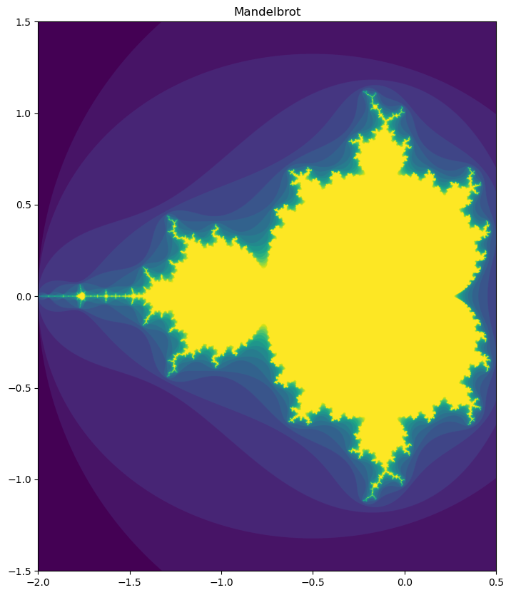

```python
import numpy as np
import matplotlib.pyplot as plt
from matplotlib import colormaps
```

## Naive Implementation


```python
def create_mandelbrot(c):
    f = lambda x: x**2 + c
    return f

def stability(number, it):
    return number / it

def run(f, it):
    x = 0
    
    number = 0
    for i in range(it):
        number = i
        x = f(x)
        if abs(x) > 2:
            break
    
    return stability(number, it)

```


```python
def plot_mandelbrot(r_upper=.5, r_lower=-2, i_upper=1.5, i_lower=-1.5, it=20):
    x = np.arange(r_lower, r_upper, 0.0005)
    y = np.arange(i_lower, i_upper, 0.0005)

    xv, yv = np.meshgrid(x, y)

    complex = xv + yv * 1j

    res = np.zeros(complex.shape)

    for idx, c in np.ndenumerate(complex):
        res[idx] = run(create_mandelbrot(c), it)

    plt.figure(figsize=(15,10))
    plt.imshow(res, extent=[r_lower, r_upper, i_lower, i_upper])
    plt.title("Mandelbrot")
    

plot_mandelbrot()


```


    

    


## Matrix-wise Implementation


```python
R_UPPER = .5
R_LOWER = -2
I_UPPER = 1.3
I_LOWER = -1.3
```


```python
def mandelbrot(x, c):
    return x**2 + c

def create_grid(stepsize, r_upper=R_UPPER, r_lower=R_LOWER, i_upper=I_UPPER, i_lower=I_LOWER):
    x = np.arange(r_lower, r_upper, stepsize)
    y = np.arange(i_lower, i_upper, stepsize)

    xv, yv = np.meshgrid(x, y)

    return xv + yv * 1j
```


```python
# it: max number of iterations to run
# sample_step: the sample step size of the grid
def plot_mandelbrot(it, sample_step, cmap="viridis"):
    # to handle overflow of very large numbers
    err_setting = np.seterr(over='ignore', invalid='ignore')
    grid = create_grid(sample_step)

    x = 0
    res = []
    for i in range(it):
        x = mandelbrot(x, grid)

        res.append((np.abs(x) <= 2).astype(int))

    stabil = np.stack(res, axis=0).sum(axis=0)

    plt.figure(figsize=(15,10))
    plt.imshow(stabil, extent=[R_LOWER, R_UPPER, I_LOWER, I_UPPER], cmap=cmap)
    plt.title("Mandelbrot")
    
```


```python
plot_mandelbrot(20, 0.0005)
```


    

    


You can alter the colormap! An Overview of availible maps can you find [here](https://matplotlib.org/stable/users/explain/colors/colormaps.html)


```python
list(colormaps)
```


    ['magma',
     'inferno',
     'plasma',
     'viridis',
     'cividis',
     'twilight',
     'twilight_shifted',
     'turbo',
     'Blues',
     'BrBG',
     'BuGn',
     'BuPu',
     'CMRmap',
     'GnBu',
     'Greens',
     'Greys',
     'OrRd',
     'Oranges',
     'PRGn',
     'PiYG',
     'PuBu',
     'PuBuGn',
     'PuOr',
     'PuRd',
     'Purples',
     'RdBu',
     'RdGy',
     'RdPu',
     'RdYlBu',
     'RdYlGn',
     'Reds',
     'Spectral',
     'Wistia',
     'YlGn',
     'YlGnBu',
     'YlOrBr',
     'YlOrRd',
     'afmhot',
     'autumn',
     'binary',
     'bone',
     'brg',
     'bwr',
     'cool',
     'coolwarm',
     'copper',
     'cubehelix',
     'flag',
     'gist_earth',
     'gist_gray',
     'gist_heat',
     'gist_ncar',
     'gist_rainbow',
     'gist_stern',
     'gist_yarg',
     'gnuplot',
     'gnuplot2',
     'gray',
     'hot',
     'hsv',
     'jet',
     'nipy_spectral',
     'ocean',
     'pink',
     'prism',
     'rainbow',
     'seismic',
     'spring',
     'summer',
     'terrain',
     'winter',
     'Accent',
     'Dark2',
     'Paired',
     'Pastel1',
     'Pastel2',
     'Set1',
     'Set2',
     'Set3',
     'tab10',
     'tab20',
     'tab20b',
     'tab20c',
     'magma_r',
     'inferno_r',
     'plasma_r',
     'viridis_r',
     'cividis_r',
     'twilight_r',
     'twilight_shifted_r',
     'turbo_r',
     'Blues_r',
     'BrBG_r',
     'BuGn_r',
     'BuPu_r',
     'CMRmap_r',
     'GnBu_r',
     'Greens_r',
     'Greys_r',
     'OrRd_r',
     'Oranges_r',
     'PRGn_r',
     'PiYG_r',
     'PuBu_r',
     'PuBuGn_r',
     'PuOr_r',
     'PuRd_r',
     'Purples_r',
     'RdBu_r',
     'RdGy_r',
     'RdPu_r',
     'RdYlBu_r',
     'RdYlGn_r',
     'Reds_r',
     'Spectral_r',
     'Wistia_r',
     'YlGn_r',
     'YlGnBu_r',
     'YlOrBr_r',
     'YlOrRd_r',
     'afmhot_r',
     'autumn_r',
     'binary_r',
     'bone_r',
     'brg_r',
     'bwr_r',
     'cool_r',
     'coolwarm_r',
     'copper_r',
     'cubehelix_r',
     'flag_r',
     'gist_earth_r',
     'gist_gray_r',
     'gist_heat_r',
     'gist_ncar_r',
     'gist_rainbow_r',
     'gist_stern_r',
     'gist_yarg_r',
     'gnuplot_r',
     'gnuplot2_r',
     'gray_r',
     'hot_r',
     'hsv_r',
     'jet_r',
     'nipy_spectral_r',
     'ocean_r',
     'pink_r',
     'prism_r',
     'rainbow_r',
     'seismic_r',
     'spring_r',
     'summer_r',
     'terrain_r',
     'winter_r',
     'Accent_r',
     'Dark2_r',
     'Paired_r',
     'Pastel1_r',
     'Pastel2_r',
     'Set1_r',
     'Set2_r',
     'Set3_r',
     'tab10_r',
     'tab20_r',
     'tab20b_r',
     'tab20c_r']


```python
plot_mandelbrot(20, 0.005, "afmhot")
```


    

    


```python

```
